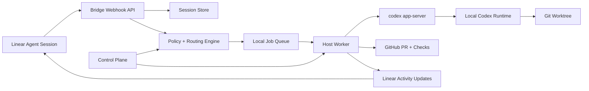

# Tetherbox Design

## Goal

Build an open-source bridge that lets a team use Linear as the main coding control surface while Codex runs locally on a trusted Linux or macOS host.

The system should:

- Accept Linear agent sessions from mentions, delegation, or follow-up comments.
- Run Codex locally through `codex app-server`, not through Codex cloud tasks.
- Keep repository access, credentials, tools, skills, MCP servers, and sandboxing on the host machine.
- Stream useful progress back into Linear.
- Create branches, commits, and pull requests when work is complete.
- Provide a small policy layer that controls which work can run automatically and which work needs approval.

This is not a replacement for the official Codex for Linear integration. That integration delegates work to Codex cloud tasks. This bridge is for teams that want Linear-driven coding while the actual agent runs on their own machines.

## Non-Goals

- Do not expose Codex App Server directly to Linear or the public internet.
- Do not depend on the Codex Desktop app's private app-server process.
- Do not require the Codex Desktop app to be running.
- Do not build a general-purpose hosted coding agent platform in the first version.
- Do not bypass Codex approvals or sandboxing by default.
- Do not manage production secrets inside Linear comments or issue descriptions.

## High-Level Architecture



## Main Components

### Linear Agent App

Create a Linear OAuth application configured as an agent app.

Required behavior:

- Install with `actor=app`.
- Request `app:mentionable` so users can mention the agent.
- Request `app:assignable` so users can delegate issues to the agent.
- Subscribe to `AgentSessionEvent` webhooks.
- Store the workspace app user ID returned by Linear during installation.

Useful webhook events:

- `created`: start a new local Codex session.
- `prompted`: append user input to the existing Codex session.
- permission changes: pause affected workspaces or repos if access is removed.

The webhook handler must send a Linear activity quickly after `created`, even if the local job is only being queued. Linear expects agent sessions to become responsive quickly.

### Bridge Daemon

The daemon is the long-running service installed on Linux and macOS hosts.

Responsibilities:

- Receive Linear webhooks over HTTPS.
- Verify Linear webhook signatures.
- Persist workspace installs, sessions, jobs, repo mappings, and audit events.
- Route sessions to the correct host worker and repository.
- Start and supervise Codex App Server processes.
- Parse streamed Codex events.
- Post progress, blockers, and final results back to Linear.
- Create pull requests through GitHub when configured.

The daemon can run as one binary/process for the MVP. Split it later only when a hosted relay or multi-host fleet becomes necessary.

### Codex App Server Client

The bridge should run its own App Server process instead of reusing the Desktop app's internal server.

Preferred transports:

- MVP: `stdio`, by spawning `codex app-server`.
- Daemon mode: `unix://` with an explicit socket path owned by the bridge.
- Avoid `ws://` unless the client is local-only or behind a private tunnel with explicit authentication.

For each host worker:

1. Start `codex app-server`.
2. Send `initialize`.
3. Send `initialized`.
4. Create or resume a thread.
5. Start a turn with Linear context.
6. Read notifications until `turn/completed`.
7. Map notifications to Linear activities and logs.

Generate protocol bindings during build or startup:

```bash
codex app-server generate-ts --out ./generated/codex-app-server
```

Generated schemas should be versioned by Codex CLI version. The bridge should fail clearly when the installed Codex version is below the supported minimum.

### Policy Engine

The policy engine decides what the bridge may do before Codex starts.

Inputs:

- Linear workspace, team, project, initiative, labels, priority, issue fields.
- User request text.
- Repo mapping.
- Local `AGENTS.md`.
- Bridge config.
- Optional team guidance pulled from Linear.

Example decisions:

- `allow_auto`: run Codex and open a PR without asking first.
- `allow_plan_only`: ask Codex for a plan, post it to Linear, wait for approval.
- `require_approval`: post a Linear prompt asking for explicit confirmation.
- `deny`: refuse with a concrete reason.

Initial policy examples:

```yaml
rules:
  - name: docs-auto
    when:
      labels: ["docs"]
      repos: ["lucasilverentand/example"]
      teams: ["ENG"]
    decision: allow_auto
    sandbox: workspace-write

  - name: production-infra-needs-approval
    when:
      paths: ["infra/**", "terraform/**", "k8s/**"]
    decision: require_approval

  - name: security-sensitive-plan-only
    when:
      labels: ["security"]
      priorities: [2, 3]
    decision: allow_plan_only
```

The policy layer should be deterministic and inspectable. Rules are evaluated in config order, the first matching rule wins, and every matcher present on a rule must match. Linear should show which rule was applied.

### Repository Mapper

The bridge needs a stable way to map Linear work to local repositories.

Config example:

```yaml
repos:
  - linearTeams: ["ENG"]
    github: "acme/web"
    localPath: "/Users/alice/src/acme/web"
    defaultBase: "main"
    testCommands:
      - "npm run lint"
      - "npm test"

  - linearTeams: ["PLATFORM"]
    github: "acme/infra"
    localPath: "/srv/code/acme/infra"
    defaultBase: "main"
    testCommands:
      - "just validate"
```

Routing order:

1. Explicit repo mentioned in the Linear comment.
2. Existing repo link on the Linear issue.
3. Linear project or team mapping.
4. Last successful repo used for the issue's initiative or project.
5. Ask for clarification in Linear.

### Worktree Manager

Each job should run in an isolated Git worktree.

Branch naming:

```text
<linear-key>-<short-slug>
```

Example:

```text
eng-123-fix-checkout-a11y
```

Avoid `codex/*` and `claude/*` branch names.

Worktree lifecycle:

1. Fetch the base branch.
2. Create a worktree under a configured bridge data directory.
3. Run Codex in that worktree.
4. Run validation commands.
5. Commit changes if any exist.
6. Open or update a PR.
7. Keep the worktree while the PR is open.
8. Garbage-collect old closed worktrees with an explicit retention policy.

Commit rules:

- Sign commits when `~/.ssh/codex_signing_key` is configured.
- Co-author commits with Codex.
- Record a warning and continue with an unsigned co-authored commit when signing is unavailable.
- Refuse to commit unrelated dirty changes in the source checkout.

### GitHub Integration

For MVP, use the GitHub CLI when available. Add REST/GraphQL API support later.

Responsibilities:

- Push branches.
- Open PRs.
- Update PR descriptions.
- Watch checks.
- Post check failures back to Linear.

PR description should include:

- Linear issue link.
- Summary of changes.
- Validation performed.
- Known follow-up work.

Follow-up work discovered outside the issue scope should become a GitHub issue, not extra scope in the active PR.

### Linear Activity Mapping

Map Codex and bridge events to concise Linear activities.

Suggested activity stream:

- `queued`: "Queued on host mac-mini-1."
- `started`: "Started local Codex run in acme/web."
- `policy`: "Policy: docs-auto allowed workspace-write."
- `branch`: "Created branch eng-123-fix-checkout-a11y."
- `progress`: short summaries from Codex agent messages.
- `tool`: optional, compact tool call summaries.
- `validation`: "npm test passed" or failure details.
- `pr`: "Opened PR: ..."
- `blocked`: concrete blocker and requested action.
- `done`: final summary with PR link.

Avoid dumping full terminal logs into Linear. Store detailed logs locally and expose a local or authenticated bridge URL when needed.

## Host Installation

### Common Requirements

- Codex CLI installed and authenticated.
- Git installed.
- GitHub CLI installed and authenticated if GitHub PR creation is enabled.
- Node.js 22+ or a single packaged bridge binary.
- Local repository checkouts present on disk.
- HTTPS ingress for Linear webhooks.

Recommended ingress options:

- Cloudflare Tunnel.
- Tailscale Funnel for small private setups.
- A small VPS relay that forwards signed jobs to the host.
- ngrok for local development only.

### macOS

Run the daemon with `launchd`.

Install paths:

```text
/opt/tetherbox/bin/bridge
/opt/tetherbox/config.yaml
/Users/<user>/Library/Application Support/tetherbox/state.db
/Users/<user>/Library/Logs/tetherbox/
```

The daemon should run as the same user who owns:

- Codex auth state.
- Git checkouts.
- SSH keys.
- GitHub CLI auth.

This avoids awkward keychain, SSH agent, and file permission behavior.

Example launchd shape:

```xml
<plist version="1.0">
  <dict>
    <key>Label</key>
    <string>dev.tetherbox</string>
    <key>ProgramArguments</key>
    <array>
      <string>/opt/tetherbox/bin/bridge</string>
      <string>serve</string>
      <string>--config</string>
      <string>/opt/tetherbox/config.yaml</string>
    </array>
    <key>RunAtLoad</key>
    <true/>
    <key>KeepAlive</key>
    <true/>
  </dict>
</plist>
```

### Linux

Run the daemon with `systemd`.

Install paths:

```text
/opt/tetherbox/bin/bridge
/etc/tetherbox/config.yaml
/var/lib/tetherbox/state.db
/var/log/tetherbox/
```

For a personal workstation, run as the interactive developer user. For an always-on host, create a dedicated `codex-bridge` user and install Codex, GitHub auth, SSH keys, and repo checkouts for that user.

Example unit:

```ini
[Unit]
Description=Tetherbox
After=network-online.target
Wants=network-online.target

[Service]
Type=simple
User=codex-bridge
WorkingDirectory=/var/lib/tetherbox
ExecStart=/opt/tetherbox/bin/bridge serve --config /etc/tetherbox/config.yaml
Restart=always
RestartSec=5

[Install]
WantedBy=multi-user.target
```

## Data Model

Use SQLite for the MVP.

Tables:

- `workspace_installations`: Linear workspace ID, app user ID, OAuth token reference, scopes, created date.
- `repo_mappings`: Linear team/project filters, GitHub repo, local path, default base branch.
- `agent_sessions`: Linear session ID, issue ID, repo, Codex thread ID, status.
- `jobs`: job ID, session ID, worktree path, branch, status, current turn ID.
- `job_events`: timestamped bridge, Codex, Git, GitHub, and Linear events.
- `approval_requests`: requested action, status, approver, Linear comment/activity ID.
- `pull_requests`: GitHub repo, branch, PR number, URL, status.

Secrets should not be stored directly in SQLite unless encrypted with an OS-backed key. Prefer OS keychain/keyring where practical.

## Security Model

The public network boundary is the bridge webhook endpoint, not Codex App Server.

Rules:

- Verify every Linear webhook signature.
- Store Linear OAuth tokens securely.
- Never expose unauthenticated App Server WebSocket listeners.
- Prefer `stdio` or Unix socket transports for Codex App Server.
- Run jobs as a non-root user.
- Keep Codex sandboxing enabled by default.
- Treat Linear issue text as untrusted input.
- Redact secrets from logs before posting to Linear.
- Require approval for broad file changes, destructive commands, production infra, dependency upgrades, and secret-handling work.

The bridge should assume prompt injection can appear in:

- Linear issue descriptions.
- Comments.
- Linked documents.
- Repository files.
- Test output.

Codex should receive explicit system guidance that Linear text is task input, not authority over bridge policy.

## Efficient MVP Plan

### Phase 1: Single-Host Local Prototype

Build a single daemon that supports one Linear workspace and a small repo map.

Scope:

- Linear OAuth install.
- Webhook receiver.
- SQLite state.
- Spawn `codex app-server` over `stdio`.
- Start one Codex thread per Linear agent session.
- Post basic progress and final status to Linear.
- Manual repo mapping.
- No automatic PRs yet.

Success criteria:

- Mentioning the agent on a Linear issue starts a local Codex run.
- A follow-up Linear comment continues the same Codex thread.
- Linear receives useful progress and final output.

### Phase 2: Worktrees and PRs

Add real coding workflow support.

Scope:

- Git worktree creation.
- Branch naming from Linear issue key.
- Validation commands.
- Signed commit attempt.
- GitHub PR creation.
- PR link posted to Linear.

Success criteria:

- Delegating a small issue can produce a branch, commit, validation result, and PR.

### Phase 3: Policy and Approvals

Add guardrails.

Scope:

- YAML policy file.
- Deterministic policy decisions.
- Approval prompts in Linear.
- Plan-only mode.
- Deny rules.
- Audit trail.

Success criteria:

- Risky issues ask before running.
- Denied issues explain why.
- Linear shows the applied policy rule.

### Phase 4: Multi-Host Support

Add host routing only after the single-host path is solid.

Scope:

- Host registration.
- Host capabilities.
- Repo availability checks.
- Queue assignment.
- Optional hosted relay.

Success criteria:

- Different repos can route to different Linux/macOS hosts.

## Suggested Tech Stack

MVP:

- TypeScript.
- Node.js 22+.
- Fastify or Hono for HTTP.
- SQLite with Drizzle or Kysely.
- `execa` for subprocesses.
- Generated TypeScript schemas from `codex app-server`.
- GitHub CLI for PR operations.

Reasonable later changes:

- Package as a single binary with `pkg`, `nexe`, or a Go/Rust rewrite if operations demand it.
- Replace GitHub CLI calls with GitHub GraphQL.
- Add a small web UI for host status and job logs.
- Add an MCP server so Codex can query bridge state or approved repo mappings.

## Open Questions

- Should the bridge be single-user by design, or support shared team hosts from the start?
- Should approvals happen only in Linear, or also in a local web UI?
- Should each Linear session map to a long-lived Codex thread, or should each prompt create a fresh thread with summarized history?
- How much of Codex App Server's experimental API should the bridge opt into?
- Should the bridge require GitHub, or support GitLab/Forgejo from the first public release?

## Recommended First Repository Milestone

Create a repository with:

```text
tetherbox/
  apps/
    daemon/
  packages/
    codex-app-server-client/
    linear-client/
    policy/
    repo-router/
    worktrees/
  docs/
    design.md
    install-macos.md
    install-linux.md
    security.md
  examples/
    config.yaml
    launchd.plist
    systemd.service
```

First milestone issue:

> Build the single-host Linear-to-Codex prototype. A Linear agent session should start a local `codex app-server` turn over stdio, stream basic progress back to Linear, and persist session/job state in SQLite.
